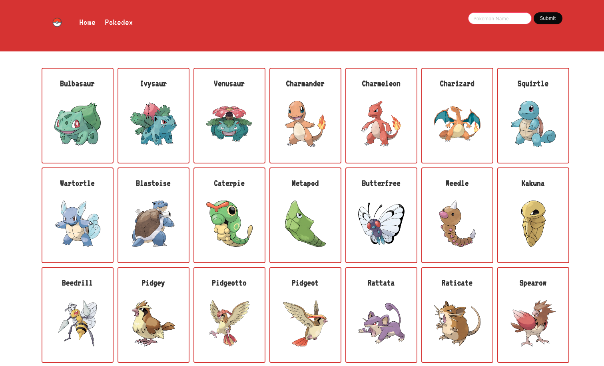
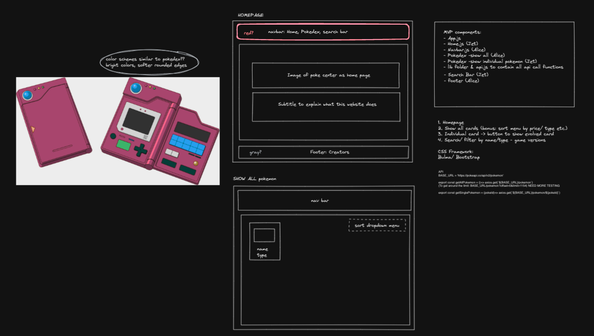
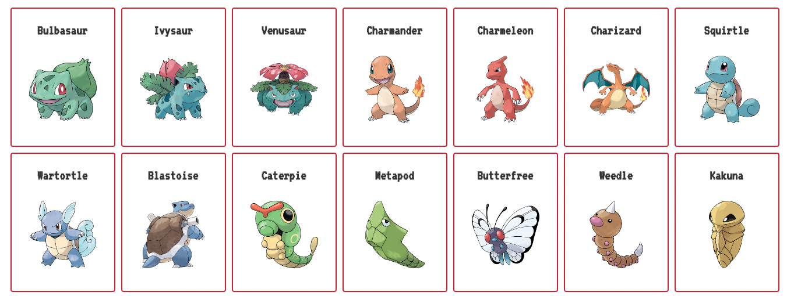

# GA PROJECT 2 - POKEDEX

## Project Description

A pair-coding project where we utilize a free API to fetch data and build a website using React. As both my teammate and I shared immense love for Pokemon growing up, we built The Pokedex using The Poke API (https://pokeapi.co/). The website shows users all the pokemons to date with individual info of name, picture, type, habitat, and descriptions, just like a Pokedex in the Nintendo Gameboy Pokemon games!



## Deployment Link

https://alicelo-pokedex.netlify.app

## Working Team & Timeframe

Working team:

- Alice Lo (https://github.com/siuusunn)
- Jet Haze (https://github.com/CodebyJet/)

Timeframe:
01/12/2022 - Project start
02/12/2022 - MVP done
05/12/2022 - Project finish

## Technologies Used

Front End:
React
Sass
Bulma

Development Tools:
Visual Code Studio

## Installation

Simply run these commands at the root of the code folder:

First, install node modules:

`$npm install`

Then start the app:

`$ npm start`

## Brief

The brief we received was to build an app that must fulfill the below requirement:

- Consume a public API – this could be anything but it must make sense for your project.
- Have several components - At least one classical and one functional.
- The app can have a router - with several "pages", this is up to your disgression and if it makes sense for your project.
- Include wireframes - that you designed before building the app.
- Be deployed online and accessible to the public.

## Planning

Although we both LOVED Pokemons, we did not instantly jump on the idea of using the Pokedex API. We went through a long list of available public APIs, looked into their data structure and endpoints, and finally decided that we would use the https://pokeapi.co/ API as the individual pokemon endpoint offers very comprehensive and detailed data and are in both arrays and objects, which was great for an app that displays data and a great way for us to polish our skills too.

We first created a wireframe together to get started with our basic components of the app, and listed out all the features and components needed for the MVP. We also gathered some pokedex images as reference for styling in the latter stage of development. We used the wireframe on Excalidraw as a guide to keep track of our progress, and we were on Zoom calls during the entire development process to discuss and trouble-shoot for each other.



It was very important to me for the team to have clear communication and an enjoyable and efficient development process, which was why right from the start we communicated on what our expectations were, what we felt comfortable or challenging doing, and the general styling direction for the app. We also wanted to divide the work as equally as possible so each of us would take both bigger components and smaller ones. Once all these were set, we started rolling!

## Code Process

The development is divided into six main components:

- Navbar
- Home
- Pokedex
- Individual Pokemon Page
- Search Bar
- Footer

My responsibilities for this project are: Navbar, Pokedex, Footer, as well as the general design of the app.

### Navbar

The navbar is straight-forward and simple, it is plain JavaScript and CSS, I also added a simple animation to the Pokeball icon when the user hovers over it because a Pokeball is meant to spin!


```
.logo {
 object-fit: scale-down;
 transition: transform 0.7s ease-in-out;


 &:hover {
   transform: rotate(360deg);
 }
}
```

### Pokedex

The Pokedex component uses `getAllPokemon()` to fetch data from the API. However, the endpoint to get all the pokemons only gives back an array of objects comprised of names and urls only, for example:

```"results": [
{
"name": "bulbasaur",
"url": "https://pokeapi.co/api/v2/pokemon/1/"
},
{
"name": "ivysaur",
"url": "https://pokeapi.co/api/v2/pokemon/2/"
},
{
"name": "venusaur",
"url": "https://pokeapi.co/api/v2/pokemon/3/"
}

```

So I used the `map` function and pass the names to the PokedexCard component to generate a new endpoint to fetch data for the `PokedexCard` component:

```
const PokedexAll = () => {
 const [pokemons, setPokemons] = useState(null);


 useEffect(() => {
   getAllPokemon()
     .then((res) => {
       setPokemons(res.data);
     })
     .catch((err) => console.error(err.response));
 }, []);


 if (!pokemons) {
   return <p>Loading</p>;
 }


 return (
   <>
     <div className="section pokedex-all">
       <div className="container">
         <div className="columns is-multiline">
           {pokemons.results.map((pokemon) => (
             <PokedexCard key={pokemon.name} pokemon={pokemon.name} />
           ))}
         </div>
       </div>
     </div>
   </>
 );
};
```

The card is its own component because I wanted to break the app down into various individual components so that they can be easily managed. The `pokemon.name` that was passed as a prop from `PokedexAll.js` is used to generate a new endpoint here, this is to tackle the endpoint problem mentioned earlier. And each individual card links to its respective pokemon detail page:

```
const PokedexCard = ({ pokemon }) => {
 const baseLink = `/pokedex-all/${pokemon}`;
 const [singlePokemonImage, setSinglePokemonImage] = useState(null);
 const [pokemonType, setPokemonType] = useState(null);


 useEffect(() => {
   axios
     .get(`${BASE_URL}/${pokemon}`)
     .then((res) => {
       setSinglePokemonImage(
         res.data.sprites.other['official-artwork'].front_default
       );
       setPokemonType(res.data.types[0].type.name);
     })
     .catch((err) => console.error(err.response));
 }, []);


 return (
   <Link to={baseLink} key={pokemon}>
     <div className="card" key={pokemon} id={pokemonType}>
       <div className="card-content">
         <p className="title is-4 is-capitalized has-text-centered">
           {pokemon}
         </p>
         <div className="card-image">
           <figure className="image is-1by1">
             </img>
           </figure>
         </div>
       </div>
     </div>
   </Link>
 );
};
```

And voila! Now all the cards show up in the Pokedex page with the cute pokemon images and their names:



## Challenges

The API does not provide one endpoint that gives access to all the data. For example, the `https://pokeapi.co/api/v2/pokemon?offset=0&limit=1154` endpoint sends back a list of pokemon names and urls to their individual endpoints.

It is more difficult to get the data and thus I had to write another get function in a sub-component to get the desired data. This is also a major block when I was trying to write a filter function for the `Pokedex.js` component.

## Wins

### Collaboration

Working with my teammate Jet Haze was a big win because we had very clear communication throughout the development, and we divided the process in a way that no one was ever blocked by the component that the other person was working on. I used the wireframe and planning document as a guide to check in with Jet from time to time to make sure we were on track and hitting our goals. As we have set the tone of honest and clear communication from the start, we were also able to be transparent about our difficulties and our capacity, and helped each other out. It was a very successful collaboration and an enjoyable process!

### Data Fetching

As mentioned above, the way the API is set up makes it quite difficult to access desired data. A big win is definitely passing the names of pokemons from `getAllPokemons()` to the `PokedexCard.js` component to generate individual endpoints to fetch the data for all the individual pokemons.

### Design

I have immense love for Pokemon, it was and still is one of my favorite gaming franchises. Right from the start I suggested the idea of using a Pokemon Center hero image and recreating the aesthetic of Pokedex with the red color tone and fonts. I am very happy with how it turned out in terms of functionality, aesthetic and user experience and I would like every Pokemon fan to smile when they see this app (at least my classmates all did when we presented the app).

## Key Learnings/ Takeaways

### Mastering React hooks like useState

This is the first project I worked on after learning React, and it taught me a lot about the practical use of unique hooks such as useState and the idea behind such hooks. Once I knew how hooks work, the development process became easier because I knew where I can store data, how to access them, and how to use them. Learning how hooks work, in my opinion, is one of the most important steps of learning React and learning how to handle data. I am glad that this project provided such exercise and allowed me to master it.

### Data Fetching

In our classwork, we worked with the TFL open API which gives you all the detailed data with a single ‘all’ endpoint, which was easy to work with. However, the Pokedex API that we worked with was drastically different since a lot of the endpoints would give back another URL. It was a big challenge but also an opportunity for me to think outside of the box and try to tackle the problem creatively. At the end I managed to do that by mapping over all the urls to fetch the data that I needed.

The data that we needed was also very nested and were sometimes multiple layers deep, Jet had problems accessing them so I jumped in to help and suggested accessing data by using array index and then `objectName[“propertyName”]`, which worked, and it was a great lesson for the both of use to learn how to access data.

The difference between APIs also made me reflect on how the APIs were designed, and the fact that there is no “perfect” public API, the perfectly designed API for me, or this app’s purpose, might not be the perfectly designed API for another person. But by learning how to fetch data that is nested and from an API that is designed differently, there is no API that you cannot work with!

### Using Frameworks like Bulma

This is the first time we were introduced to React frameworks and after looking at multiple different frameworks we decided that Bulma would fit the purpose of this Pokedex app the best. It was a great lesson for me on choosing frameworks and their components according to what I need and how to use them effectively to make the development process easier and make the app look more appealing and up to today’s standard in terms of UI and UX. Learning how to work with frameworks also opened the door to a million possibilities out there as there are so many different ones and packages out there to help developers, and I am very excited to try different ones!

## Bugs

The results list of the search bar doesn't clear after the input field is cleared

> Due to time constraints, we could not get the search bar to clear after the input field was cleared, this thus alters the size of the navbar and affects the overall look of the website. Most probably adding a condition so that the option table does not show if the input field is empty would suffice. But if I had more time, I would use the search bar component from an external framework as it has the built-in functionality for an elegant search bar already.

## Future Improvements

### Filter and Sort Functionalities for Pokedex

A filter and a sort function are essential to an index in my opinion, it is a Pokedex afterall, and there are thousands of Pokemons out there in the wild! I would love to add a filter function in the “pokedexAll” component where users can filter Pokemons by type, origins etc., so that the index becomes a highly functional page where users can see the bulk data that they want. Similarly for sort function, I would love to enable users to sort Pokemons by name, weight, date created etc., if these two functionalities were added, the “Pokedex” page would come alive!

### Pagination

Adding pagination would be great for the Pokedex page because at the moment the page shows all the pokemons with images all at once, but the downside is that it would slow down the rendering process (and if the user’s internet speed is slow, it would take even longer). I believe adding pagination would take off some burden on this, as it renders only a set amount of data each page, instead of all.
